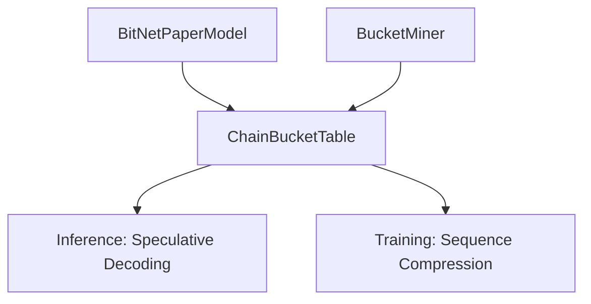
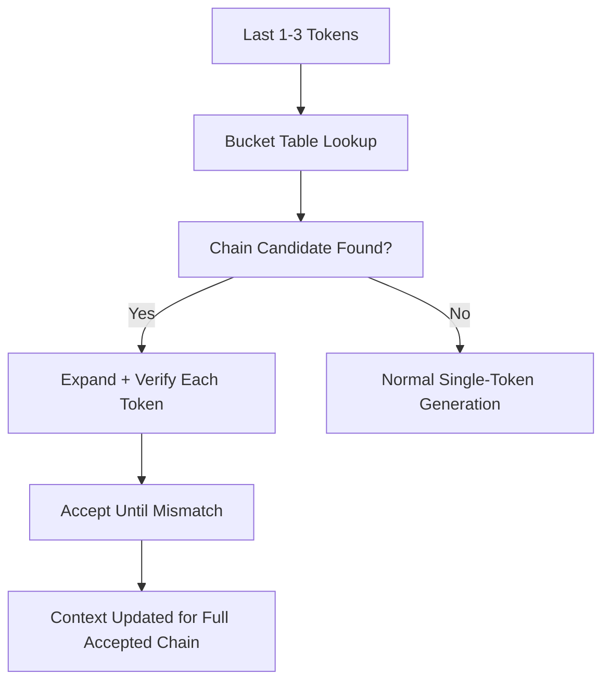
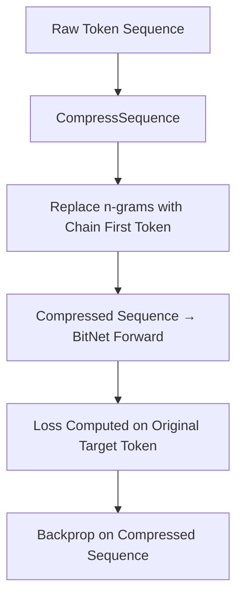
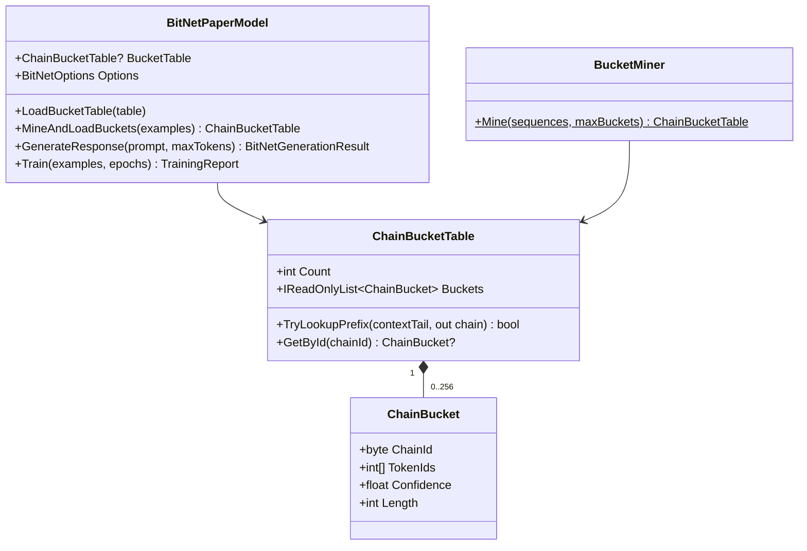

# BitNet-b1.58-Sharp: Bucketing Implementation Plan v1.0
**Chain-Bucket Speculative Decoding + Training-Time Sequence Compression**
**Core Feature for Inference Speedup and Training Efficiency**

**Version:** 1.0
**Date:** March 20, 2026
**Status:** Production-ready blueprint

---

## Table of Contents
1. Executive Summary & Success Criteria
2. Prerequisites & Integration Points
3. Overall Architecture
4. Phase 1: Offline Bucket Mining Pipeline (5–7 days)
5. Phase 2: Inference-Time Chain-Bucket Speculative Decoding (7–10 days)
6. Phase 3: Training-Time Sequence Compression with Super-Tokens (8–12 days)
7. Phase 4: Quality Safeguards, Evaluation & Benchmarks (5–7 days)
8. Phase 5: CLI, Documentation & Release (3–5 days)
9. Full UML Catalog (Object & Logic Examples)
10. Risk Register & Mitigation
11. Timeline, Milestones & Effort Estimates
12. Future Extensions

---

## 1. Executive Summary & Success Criteria
Goal: Add **bucketing** as a core optimization that accelerates both inference (via speculative multi-token jumps) and training (via compressed token sequences using super-tokens).

**Success Criteria**
- Inference: ≥ 1.8× tokens/sec uplift with ≥ 70 % chain acceptance rate
- Training: ≥ 25 % reduction in effective sequence length and training time
- Zero quality regression (verified by perplexity and downstream metrics)
- Fully optional via `BitNetOptions` (enabled by default for new models)
- Works with any tokenizer and any BitNet checkpoint

---

## 2. Prerequisites & Integration Points
- Existing `BitNetTransformer`, `BitNetPaperModel`, and training loop
- `BitNetOptions` class (for toggles)
- Existing tokenizer and training corpus
- Benchmark suite (TinyLlama-1.1B + perplexity)

---

## 3. Overall Architecture

---

## 4. Phase 1: Offline Bucket Mining Pipeline (5–7 days)
1. Create `BucketMiner` service that scans tokenized corpora.
2. Extract frequent n-grams (n=2 to n=8).
3. Score candidates by frequency × conditional probability.
4. Pack top candidates into exactly 256 buckets (one byte).
5. Store: `byte ChainID → TokenID[] chain + float confidence`.
6. Output: `ChainBucketTable` (versioned, < 50 KB).

**Implementation:** `src/BitNetSharp.Core/Bucketing/BucketMiner.cs`

---

## 5. Phase 2: Inference-Time Chain-Bucket Speculative Decoding (7–10 days)
**Core flow:**
1. After each token, check last 1–3 tokens against bucket prefixes.
2. If match found, speculatively emit continuation tokens from the matching chain.
3. Run parallel verification pass: confirm model top-1 prediction matches each chain token.
4. Accept tokens sequentially until first mismatch (classic speculative safety).
5. Context window updated once for the entire accepted chain.

**Integration:**
- Extend `BitNetPaperModel.GenerateResponse()` with optional bucketing path.
- Add `ChainBucketTable` loaded via `MineAndLoadBuckets()` or `LoadBucketTable()`.
- Configurable via `BitNetOptions.EnableChainBuckets` and `MaxChainLength`.

**Implementation:** `src/BitNetSharp.Core/BitNetPaperModel.cs`

---

## 6. Phase 3: Training-Time Sequence Compression with Super-Tokens (8–12 days)
**New capability:** During training, replace frequent n-grams with a single first-token placeholder to shorten sequences.

**Steps:**
1. Before each training batch forward pass, scan the prompt sequence for chains.
2. Replace matching n-grams with just the first token of the chain.
3. During forward pass, the model sees compressed sequences (shorter context = faster training).
4. Loss is still computed against the original first target token.
5. Periodic re-mining at startup or on demand adapts to corpus content.

**BitNet specifics:**
- Compression is applied to the INPUT context only; target tokens are unchanged.
- Re-quantization schedule unchanged.
- Expected benefit: 20–35 % reduction in training tokens processed per epoch.

**Configuration:** `BitNetOptions.EnableSequenceCompression = true`

**Implementation:** `src/BitNetSharp.Core/BitNetPaperModel.cs` (`CompressSequence` helper)

---

## 7. Phase 4: Quality Safeguards, Evaluation & Benchmarks (5–7 days)
1. Add verification step: every generated chain must match model top-1 probabilities.
2. Perplexity check on compressed vs uncompressed validation set.
3. Benchmark suite extension:
   - Tokens/sec with/without bucketing
   - Training time per epoch with/without sequence compression
   - Acceptance rate and compression ratio metrics
4. Add to existing TinyLlama-1.1B benchmark pipeline.

---

## 8. Phase 5: CLI, Documentation & Release (3–5 days)
1. CLI commands:
   - `dotnet run -- chat "hello" --enable-bucketing`
   - `dotnet run -- train --enable-bucketing`
   - `dotnet run -- datagen --domain code --count 10 --output data.jsonl`
2. Update `/docs/bucketing-guide.md` with usage, expected speedups, and quality notes.
3. Add to main README as core optimization feature.
4. Release with pre-mined bucket tables for common tokenizers.

**Implementation:** `src/BitNetSharp.App/Program.cs`

---

## 9. Full UML Catalog (Object & Logic Examples)

**Inference-Time Flow**

**Training-Time Compression Flow**

**Class Structure**

---

## 10. Risk Register & Mitigation
| Risk | Likelihood | Impact | Mitigation |
|------|------------|--------|------------|
| Quality regression from compression | Medium | High | Strong verification + perplexity guardrails |
| Bucket table staleness | Low | Medium | Periodic re-mining during training |
| Increased memory for table | Low | Low | 256 buckets only (~few KB) |

---

## 11. Timeline, Milestones & Effort Estimates (Solo Developer)
- Phase 1: 5–7 days → "Bucket Mining Ready"
- Phase 2: 7–10 days → "Inference Bucketing Live"
- Phase 3: 8–12 days → "Training Compression Live"
- Phase 4–5: 8–12 days → "Full Release"

**Total estimated effort:** 35–50 days (highly parallelizable with existing training loop).

---

## 12. Future Extensions
- Dynamic bucket updating during training
- Multi-byte chain IDs for >256 buckets
- Integration with DataGen SLM for bucket-aware synthetic data

**End of Document**
