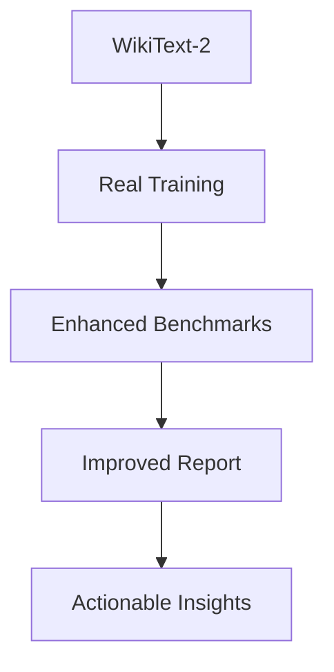

# Full Implementation Plan: Real Training + Enhanced Benchmarks + Repository Purity v1.0
**Address All Three Issues in One Cohesive Plan**  
**Core Repository – Strictly Domain-Agnostic**

**Version:** 1.0  
**Date:** March 20, 2026  
**Status:** Ready-to-execute

> **Dependency note:** WikiText-2 validation download and tokenization are being added in PR #27. This plan assumes that dependency merges first and then consumes those repository-local artifacts.

---

## Table of Contents

1. [Executive Summary & Success Criteria](#1-executive-summary--success-criteria)
2. [Prerequisites](#2-prerequisites)
3. [Overall Architecture](#3-overall-architecture)
4. [Phase 1: Enforce Repository Purity & Architecture Guidelines (1–2 days)](#4-phase-1-enforce-repository-purity--architecture-guidelines-12-days)
5. [Phase 2: Implement Real Training Loop (7–10 days)](#5-phase-2-implement-real-training-loop-710-days)
6. [Phase 3: Build Enhanced Benchmark Suite with TinyLlama-1.1B (6–8 days)](#6-phase-3-build-enhanced-benchmark-suite-with-tinyllama-11b-68-days)
7. [Phase 4: Create Improved Report that Surfaces Strengths & Deficiencies (3–4 days)](#7-phase-4-create-improved-report-that-surfaces-strengths--deficiencies-34-days)
8. [Phase 5: CI Integration & Release (2 days)](#8-phase-5-ci-integration--release-2-days)
9. [Full UML Catalog](#9-full-uml-catalog)
10. [Risk Register & Mitigation](#10-risk-register--mitigation)
11. [Timeline & Effort Estimates](#11-timeline--effort-estimates)

---

## 1. Executive Summary & Success Criteria

This plan replaces the stub training, expands benchmarks to include TinyLlama-1.1B, perplexity, and real-world task comparisons, and redesigns the report to clearly show where BitNet wins on speed and memory and where it still needs quality improvements.

### Success Criteria

- Training runs multiple epochs with real data and visibly reduces loss
- Benchmarks measure perplexity, reasoning, code, and efficiency on TinyLlama-1.1B
- Report shows zero-based quality delta and clearly flags deficiencies
- Repository remains 100% domain-agnostic with no vertical code

---

## 2. Prerequisites

- Existing `BitNetModel`, `BitLinear`, tokenizer, and SpecFlow tests
- BenchmarkDotNet already added to the test project
- WikiText-2 validation set downloaded and pre-tokenized by PR #27

---

## 3. Overall Architecture

```mermaid
flowchart TD
    A[WikiText-2 Loader] --> B[Real Training Loop (Epochs + STE)]
    B --> C[BenchmarkDotNet Suite (TinyLlama-1.1B)]
    C --> D[Perplexity + Zero-Shot + Code + Efficiency]
    D --> E[Improved Report (Strengths vs Deficiencies)]
```

---

## 4. Phase 1: Enforce Repository Purity & Architecture Guidelines (1–2 days)

1. Commit `docs/repo-alignment-guidelines.md` from the prior discussion.
2. Update the root `README.md` with a repository-purity banner and no vertical mentions.
3. Add a pull request template that requires a purity checklist.
4. Move any stray domain code, if present, to a new companion repository stub.

---

## 5. Phase 2: Implement Real Training Loop (7–10 days)

Replace the stub in `BitNetModel.cs` with a training API shaped like this:

```csharp
public TrainingReport Train(int epochs, IDataLoader loader)
{
    var optimizer = new AdamWOptimizer(3e-4f, 0.1f);
    var report = new TrainingReport();

    for (int e = 0; e < epochs; e++)
    {
        double totalLoss = 0;
        int count = 0;

        foreach (var batch in loader.GetBatches())
        {
            var logits = Forward(batch.Input);
            var loss = CrossEntropyLoss(logits, batch.Target);
            totalLoss += loss.Value * batch.Size;
            count += batch.Size;

            loss.BackwardWithSTE();
            optimizer.Step(Parameters);
            optimizer.ZeroGrad();
        }

        ReQuantizeAllLayers();
        report.AddEpoch(e, totalLoss / count);
    }

    return report;
}
```

Implement `IDataLoader`, `AdamWOptimizer`, and `CrossEntropyLoss` with STE support.

---

## 6. Phase 3: Build Enhanced Benchmark Suite with TinyLlama-1.1B (6–8 days)

Create `tests/BitNetSharp.Tests/Benchmarks/TinyLlamaBenchmark.cs`:

```csharp
[Config(typeof(BitNetBenchmarkConfig))]
public class TinyLlamaBenchmark
{
    [Benchmark] public void TrainingEpoch() => model.Train(1, wikiLoader);
    [Benchmark] public double PerplexityBitNet() => model.CalculatePerplexity(wikiLoader);
    [Benchmark] public double ARCEasyAccuracy() => model.EvaluateZeroShot(ARC_Easy);
    [Benchmark] public double HumanEvalPass1() => model.EvaluateHumanEval();
}
```

Add a WikiText-2 loader and zero-shot evaluators.

---

## 7. Phase 4: Create Improved Report that Surfaces Strengths & Deficiencies (3–4 days)

Update `ReportGenerator.cs` to emit a clear comparison table:

```markdown
Category              | Metric                  | BitNet   | Traditional | Delta          | Interpretation
----------------------|-------------------------|----------|-------------|----------------|-------------------------------
Language Modeling     | WikiText-2 PPL          | 18.4     | 17.1        | -7.6%          | Minor quality gap
Reasoning             | ARC-Easy Accuracy       | 61%      | 68%         | -10.3%         | Needs improvement
Code Generation       | HumanEval Pass@1        | 19%      | 25%         | -24%           | Significant deficiency
Efficiency            | CPU Tokens/sec          | 48       | 13          | +269%          | Major win
Efficiency            | Memory (MB)             | 1,150    | 4,600       | 4× smaller     | Strong advantage
```

Delta is zero-based: `0%` means parity, positive means better, and negative means worse.

---

## 8. Phase 5: CI Integration & Release (2 days)

- Add a nightly benchmark job in GitHub Actions
- Publish the report to `docs/benchmarks/latest.html`
- Tag a release when perplexity delta and speed targets are met

---

## 9. Full UML Catalog

### Full Pipeline



---

## 10. Risk Register & Mitigation

| Risk | Likelihood | Mitigation |
|------|------------|------------|
| Training still stub-like | High | Enforce a minimum of 3 epochs plus a real data loader |
| Report misleading | Medium | Use zero-based delta plus explicit better/worse labels |
| Scope creep | High | Require a purity checklist in every PR |

---

## 11. Timeline & Effort Estimates

| Phase | Estimate |
|------|----------|
| Phase 1: Enforce Repository Purity & Architecture Guidelines | 1–2 days |
| Phase 2: Implement Real Training Loop | 7–10 days |
| Phase 3: Build Enhanced Benchmark Suite with TinyLlama-1.1B | 6–8 days |
| Phase 4: Create Improved Report that Surfaces Strengths & Deficiencies | 3–4 days |
| Phase 5: CI Integration & Release | 2 days |
| **Total** | **19–26 days** |

This plan keeps all work inside the core repository while remaining strictly domain-agnostic. It is intended to address stub training, benchmark quality, and report clarity as one coordinated roadmap.
