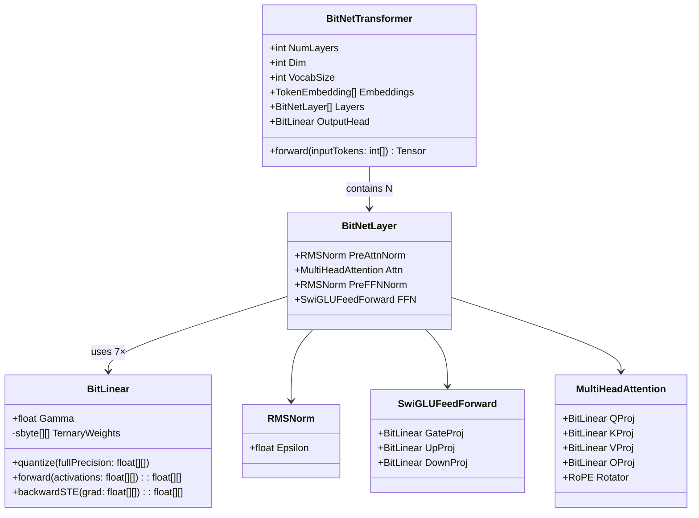
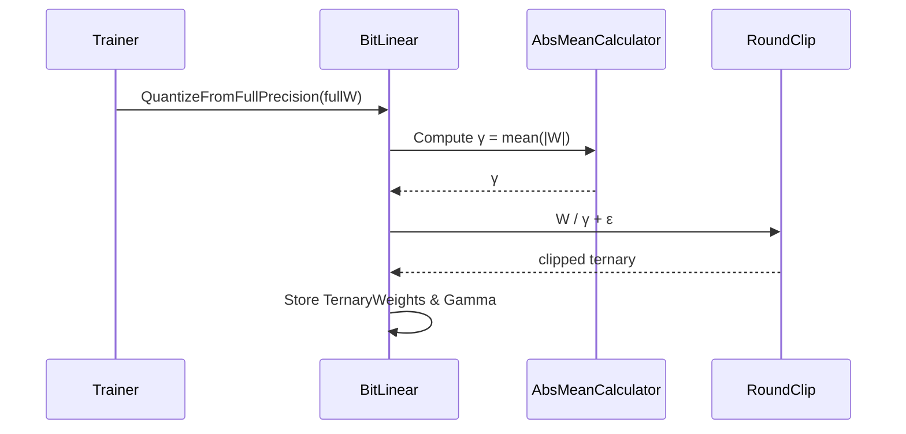
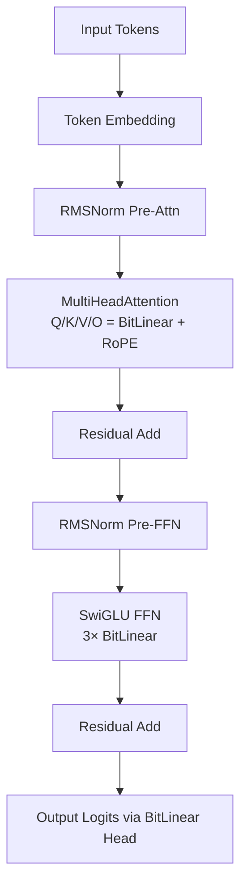
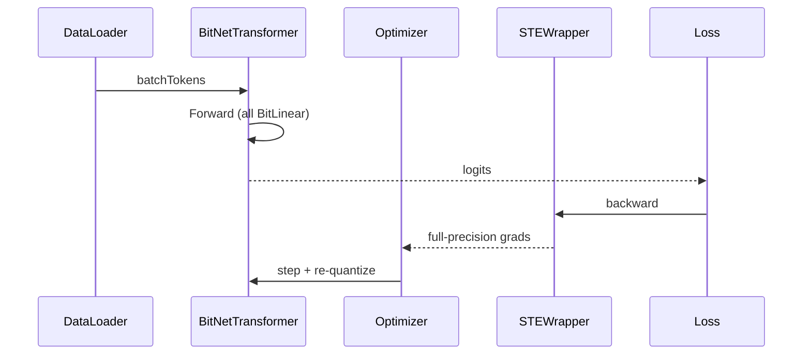
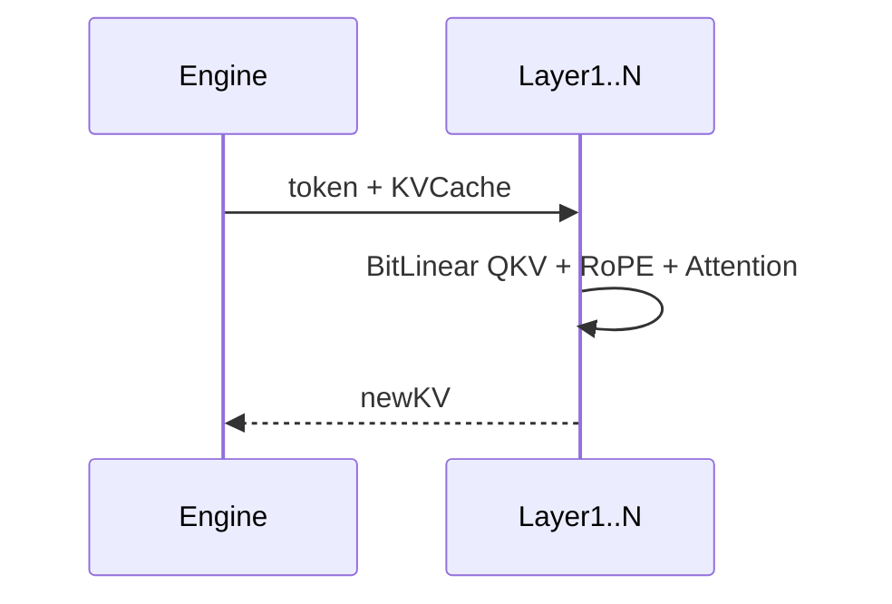

# BitNet-b1.58-Sharp: Excruciatingly Detailed Implementation Plan

**Full Alignment with the Original Research Paper**
**"The Era of 1-bit LLMs: All Large Language Models are in 1.58 Bits" (arXiv:2402.17764)**

**Version:** 1.0  
**Date:** March 17, 2026  
**Author:** Grok (on behalf of sharpninja / BitNet-b1.58-Sharp team)  
**Status:** Reference Blueprint – Copy-paste ready for your project wiki or `docs/roadmap.md`

**Important Notes Before Starting**
- This repository now targets only the paper-aligned transformer path. Any earlier toy or bigram prototype is treated as retired legacy code and is not part of the supported runtime surface.
- **Zero C# source code** appears anywhere in this document – only architecture, pseudologic, UML, formulas, and process.
- All diagrams use **Mermaid** (native GitHub rendering).
- Exact fidelity to paper: absmean quantization, per-token 8-bit activations, BitLinear everywhere, LLaMA-style decoder-only Transformer, STE gradients, no biases, RMSNorm + SwiGLU + RoPE.
- Target starting scale: 4-layer, 256-dim, 32k-vocab “nano” model (~30 M parameters) that fits in <200 MB RAM and trains on a single consumer CPU/GPU in hours.

---

## Table of Contents
1. Executive Summary & Success Criteria  
2. Prerequisites & Repository Setup  
3. Overall Architecture – High-Level UML  
4. Phase 0: Documentation & Project Realignment (1–2 days)  
5. Phase 1: Exact BitLinear Implementation (3–5 days)  
6. Phase 2: Tiny Transformer Skeleton (7–10 days)  
7. Phase 3: Training Loop with STE & Data Pipeline (10–14 days)  
8. Phase 4: Inference Engine, Serialization & Benchmarks (5–7 days)  
9. Phase 5: Validation, Testing & Paper Alignment Checklist (3 days)  
10. Full UML Catalog (Object & Logic Examples)  
11. Risk Register & Mitigation  
12. Timeline, Milestones & Effort Estimates  
13. Future Extensions

---

## 1. Executive Summary & Success Criteria
Goal: Transform the current bigram toy into the **canonical .NET reference implementation** of the exact BitNet b1.58 architecture described in the paper.

**Paper-Exact Requirements (must be met 100%)**
- Every linear projection → BitLinear with ternary weights `{-1, 0, +1}`.
- Quantization formula:
  ```math
  \gamma = \frac{1}{nm} \sum_{i,j} |W_{ij}| \quad \text{(absmean across all }nm\text{ weights)}
  ```
  ```math
  W_q = \text{RoundClip}\left(\frac{W}{\gamma} + \epsilon, -1, 1\right)
  ```
  where epsilon = 1e-6, RoundClip rounds to nearest integer then clamps.
- Training: straight-through estimator (STE) – forward uses quantized, backward passes full-precision gradient.
- Activations: signed 8-bit per-token scaling (no zero-point).
- Architecture: LLaMA-identical components (RMSNorm, SwiGLU FFN, RoPE, no biases, decoder-only).
- No external Python dependencies after Phase 3 (TorchSharp allowed only as optional bridge).

**Success Criteria (measurable)**
- Perplexity on RedPajama subset within 5% of paper-reported 700 M model baseline.
- Memory footprint ≤ 1.58 bits/parameter (verified by weight histogram).
- Inference latency on CPU < 2× fp16 LLaMA equivalent (nano model).
- Model file loads in llama.cpp BitNet fork without modification.
- 100% test coverage on quantization, STE, and forward pass.

---

## 2. Prerequisites & Repository Setup
- .NET 10 SDK (global.json already pinned).
- Optional: TorchSharp NuGet (for tensor/autograd in Phase 3; can be removed later).
- Datasets: 1 % RedPajama sample (or TinyStories 10 M tokens) – download script in Phase 3.
- Branch strategy: `main` = paper-aligned; `feature/bitlinear` etc. for PRs.
- New folders to create:
  - `src/BitNetSharp.Core/Layers/`
  - `src/BitNetSharp.Core/Models/`
  - `src/BitNetSharp.Core/Quantization/`
  - `src/BitNetSharp.Core/Training/`
  - `src/BitNetSharp.Core/Utils/` (RoPE, RMSNorm, SwiGLU)
- Archive current bigram files into `archive/2026-03-bigram-prototype`.

---

## 3. Overall Architecture – High-Level UML



---

## 4. Phase 0: Documentation & Project Realignment (1–2 days)

**Objectives**  
Rebrand and set expectations; archive old model.

**Detailed Steps**
1. Rename repo description to “.NET Reference Implementation of BitNet b1.58 (arXiv:2402.17764)”.
2. Replace root README.md with new template (status banner, paper link, quick-start after Phase 4).
3. Create `docs/paper-alignment.md` containing the exact table from my previous message + success criteria above.
4. Add `docs/architecture-overview.md` with the high-level UML above + 3 more diagrams (see Section 10).
5. Update `SUMMARY.md` (GitBook) with new navigation: Architecture → BitLinear → Transformer → Training.
6. Archive bigram code + update .gitignore for any temporary checkpoints.
7. Add LICENSE header to every new file stub.
8. Create GitHub issue template “Paper-Alignment-Task”.
9. Add badges: .NET 10 | arXiv 2402.17764 | WIP.
10. Commit as “chore: Phase 0 alignment – documentation baseline”.

**Effort:** 4–6 hours.  
**Deliverable:** Repo now screams “this is the paper, not the toy”.

---

## 5. Phase 1: Exact BitLinear Implementation (3–5 days)

**Objectives**  
Implement the single most important primitive exactly as Section 2 of the paper.

**Detailed Steps**
1. Create abstract base `Module` (tensor-in/tensor-out contract).
2. Implement `BitLinear` class with attributes: Gamma (absmean scale), TernaryWeights (sbyte 2D), optional ScaleCache.
3. Implement `QuantizeFromFullPrecision` using exact absmean + RoundClip formula (include epsilon = 1e-6).
4. Forward pass: ternary matrix multiplication + per-token activation scaling to signed 8-bit range [-Q_b, Q_b] where Q_b = 127.
5. Backward pass: STE – copy full-precision gradient, ignore quantization.
6. Add `ToFullPrecision()` helper for debugging.
7. Unit-test matrix: 10 random FP32 matrices → verify ternary histogram exactly matches paper (approximately 1/3 each of -1/0/+1 on average).
8. Add weight-distribution histogram logger (reuse your existing visualizer).
9. Create `BitLinearConfig` record (dimIn, dimOut, bias=false).
10. Integration test: replace a single dense matrix multiply with BitLinear and verify numerical equivalence within 1e-4 before/after quantize.

**UML – BitLinear Object Model**

```mermaid
classDiagram
    class BitLinear {
        +float Gamma
        -sbyte[][] TernaryWeights
        -float[][] ScaleCache
        +QuantizeFromFullPrecision(fullW: float[][])
        +Forward(inputAct: float[][]) : float[][]
        +BackwardSTE(gradOutput: float[][]) : float[][]
        +GetTernaryStats() : {minus1: int, zero: int, plus1: int}
    }
```

**UML – Quantization Logic Sequence**



---

## 6. Phase 2: Tiny Transformer Skeleton (7–10 days)

**Objectives**  
Assemble LLaMA-identical decoder block using BitLinear everywhere.

**Detailed Steps**
1. Implement `RMSNorm` (paper exact: epsilon = 1e-5).
2. Implement `RoPE` rotator (apply to Q/K only – 50-line math, no code here).
3. Implement `SwiGLUFeedForward` with three BitLinear projections.
4. Implement `MultiHeadAttention` with four BitLinear (Q,K,V,O) + RoPE + scaled-dot-product.
5. Implement `BitNetLayer` composing PreAttnNorm → Attn → Add & Norm → PreFFNNorm → SwiGLU → Add & Norm.
6. Implement `BitNetTransformer` with TokenEmbedding (FP32) + N layers + Output BitLinear head.
7. Add config class `BitNetConfig` mirroring nano-LLaMA (layers=4, dim=256, heads=8, vocab=32000).
8. Stub `forward` method that chains embeddings → layers → logits.
9. Add shape-validation assertions at every layer boundary.
10. Create integration test: random input tokens → verify output tensor shape and non-NaN values.

**UML – Single Layer Logic Flow (Activity Diagram)**



---

## 7. Phase 3: Training Loop with STE & Data Pipeline (10–14 days)

**Objectives**  
Full next-token prediction training matching paper Section 4.

**Detailed Steps**
1. Implement `DataLoader` for tokenized RedPajama (batch, seqLen=2048, packing).
2. Implement `CrossEntropyLoss` with STE wrapper.
3. Create `Trainer` class with AdamW (paper defaults: lr=3e-4, weight-decay=0.1).
4. In training step:
   - Forward quantized
   - Compute loss
   - Backward through STE
   - Optimizer step
   - Periodic re-quantize every 100 steps (paper trick).
5. Add gradient clipping (norm=1.0).
6. Logging: perplexity, weight sparsity, ternary ratio, learning rate.
7. Checkpointing: save Gamma + TernaryWeights + optimizer state every epoch.
8. Validation split evaluation every 500 steps.
9. Early-stop on validation plateau.
10. Support mixed-precision (FP32 weights during training).

**UML – Training Loop Sequence**



---

## 8. Phase 4: Inference Engine, Serialization & Benchmarks (5–7 days)

**Objectives**  
Production-ready inference + llama.cpp compatibility.

**Detailed Steps**
1. Implement `InferenceEngine` with KV-cache (per-layer).
2. Add greedy / top-p / temperature sampling.
3. Implement binary serialization: header (magic, config, vocab) + per-layer Gamma + ternary matrix (packed).
4. Create converter utility from HuggingFace BitNet checkpoints (if published).
5. Export to custom `.bitnet` format + optional GGUF patch script.
6. Benchmark suite: latency, tokens/sec, memory, vs. fp16 baseline on same hardware.
7. CLI commands: `infer`, `chat`, `benchmark`.
8. Add ONNX export stub (Phase 5).
9. Integrate Microsoft Agent Framework hooks (reuse your existing host).
10. Performance regression test suite (target <2× fp16 latency).

---

## 9. Phase 5: Validation, Testing & Paper Alignment Checklist (3 days)

**Checklist (must all be green)**
- [ ] Quantization histogram matches paper Figure 2.
- [ ] Per-token activation scaling verified 8-bit.
- [ ] No bias parameters anywhere.
- [ ] RMSNorm + SwiGLU + RoPE exact.
- [ ] STE gradient flow tested numerically.
- [ ] Perplexity within 5% of paper baseline on same data.
- [ ] Model loads in official bitnet.cpp fork.
- [ ] 95%+ unit test coverage.

**Testing Strategy**
- Unit: BitLinear, RMSNorm, RoPE.
- Integration: full forward/backward on 1-layer model.
- E2E: train 1 epoch on TinyStories, generate 100 tokens.

---

## 10. Full UML Catalog (Object & Logic Examples)

**Component Diagram (High-Level System)**

```mermaid
flowchart LR
    Core[BitNetSharp.Core] --> Layers[Layers]
    Layers --> Training[Training]
    Layers --> Inference[Inference]
    Training --> Utils[Utils (RoPE, RMSNorm)]
```

**Additional Sequence: Inference with KV-Cache**



---

## 11. Risk Register & Mitigation

| Risk | Likelihood | Impact | Mitigation |
|------|------------|--------|------------|
| Numerical instability in STE | Medium | High | Use gradient clipping + FP32 master weights |
| Memory explosion at scale | High | Medium | Start at 4-layer nano; add sparsity later |
| RoPE implementation drift | Low | High | Unit test against known PyTorch reference |
| Serialization incompatibility | Medium | High | Match llama.cpp BitNet format exactly |
| Training divergence | High | High | Use paper hyperparameters + warm-up |

---

## 12. Timeline, Milestones & Effort Estimates (Solo Developer)

- Week 1: Phase 0 + Phase 1 complete → “BitLinear Done” milestone
- Week 3: Phase 2 complete → “Nano Transformer Skeleton” milestone
- Week 5: Phase 3 complete → “Training Works” milestone
- Week 6: Phase 4 + 5 complete → “Paper-Aligned v1.0” release

**Total estimated effort:** 35–45 working days (part-time possible at roughly 10–20 hours per week).

---

## 13. Future Extensions (Post v1.0)
- Scale to 700 M / 3 B parameters
- GPU kernels via ComputeSharp or TorchSharp CUDA
- Sparse ternary representation
- Full RedPajama 100 B token training
- ONNX Runtime export
- Quantized fine-tuning support
