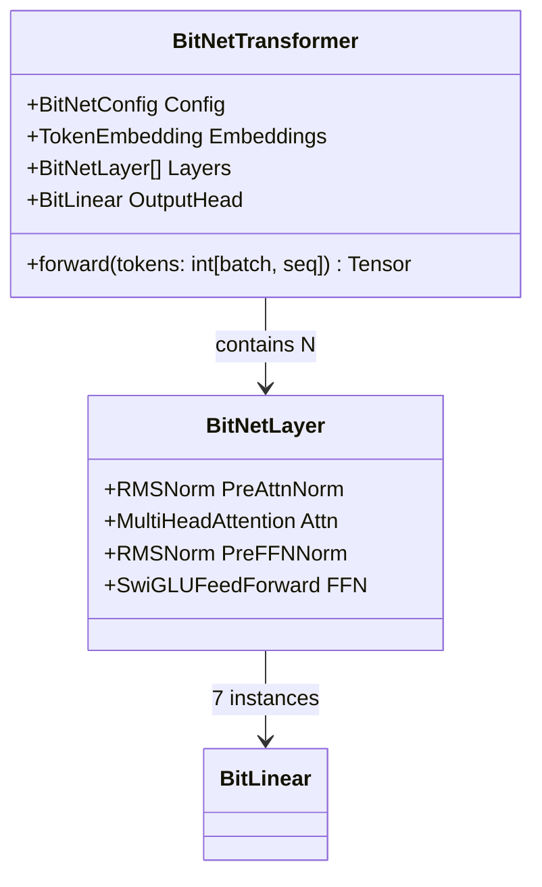
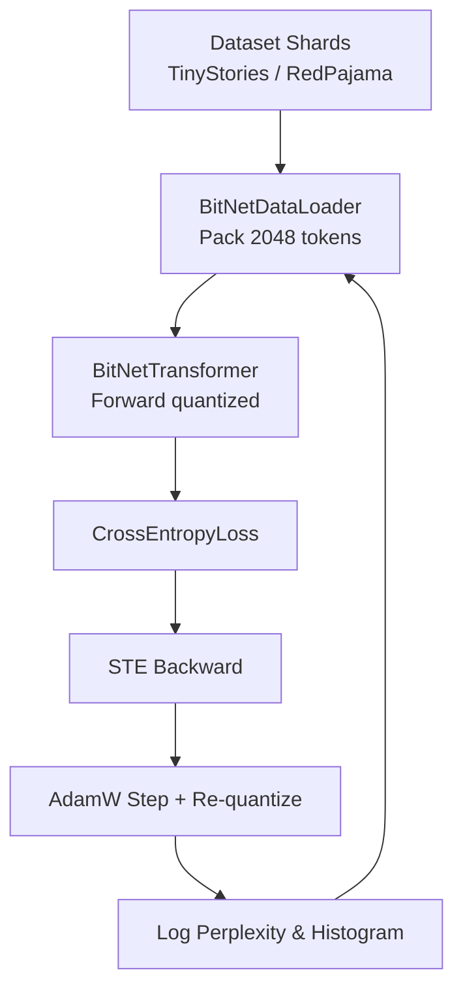
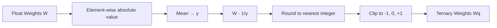
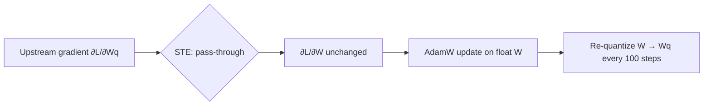
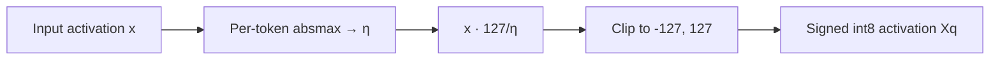
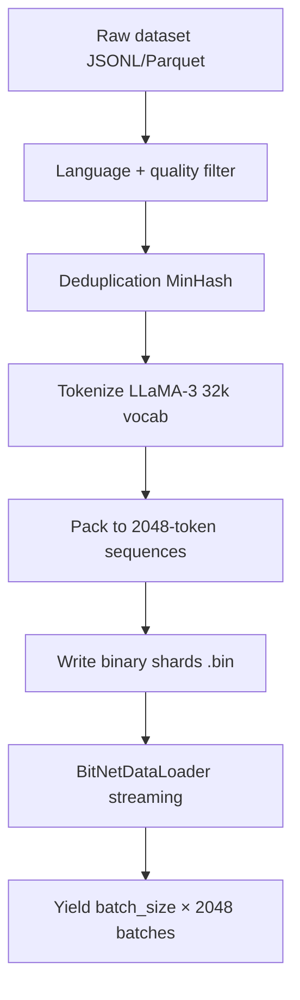

# BitNet-b1.58-Sharp: Highly Detailed Implementation Plan v2.0
**Full Paper Alignment + Comprehensive Training Datasets Strategy**
**"The Era of 1-bit LLMs: All Large Language Models are in 1.58 Bits" (arXiv:2402.17764)**

**Version:** 2.0 (Updated March 19, 2026)
**Date:** March 19, 2026
**Status:** Ready-to-execute blueprint

> **Note:** This plan has been superseded by [Implementation Plan v3](implementation-plan-v3.md). It is retained here for historical reference.
>
> **Key additions in v2 over v1:** Dedicated training datasets strategy (Section 3), tiered development approach, download/prep pseudocode, and expanded UML catalog.

---

## Table of Contents

1. [Executive Summary & Success Criteria](#1-executive-summary--success-criteria)
2. [Prerequisites & Repository Setup](#2-prerequisites--repository-setup)
3. [Training Datasets Strategy](#3-training-datasets-strategy-paper-aligned--tiered-for-development)
4. [Overall Architecture – High-Level UML](#4-overall-architecture--high-level-uml)
5. [Phase 0: Documentation & Realignment (1–2 days)](#5-phase-0-documentation--realignment-12-days)
6. [Phase 1: Exact BitLinear Implementation (3–5 days)](#6-phase-1-exact-bitlinear-implementation-35-days)
7. [Phase 2: Tiny Transformer Skeleton (7–10 days)](#7-phase-2-tiny-transformer-skeleton-710-days)
8. [Phase 3: Training Loop + Data Pipeline (14–21 days)](#8-phase-3-training-loop--data-pipeline-1421-days)
9. [Phase 4: Inference, Serialization & Benchmarks (7–10 days)](#9-phase-4-inference-serialization--benchmarks-710-days)
10. [Phase 5: Validation, Testing & Paper Alignment Checklist (5 days)](#10-phase-5-validation-testing--paper-alignment-checklist-5-days)
11. [Full UML Catalog](#11-full-uml-catalog)
12. [Risk Register & Mitigation](#12-risk-register--mitigation)
13. [Timeline, Milestones & Effort Estimates](#13-timeline-milestones--effort-estimates)
14. [Future Extensions](#14-future-extensions)

---

## 1. Executive Summary & Success Criteria

Goal: Deliver the **first canonical pure-C# reference implementation** of BitNet b1.58 that matches the paper **exactly** in architecture, quantization, and training procedure – including reproducible results on the paper's datasets.

### Paper-Exact Requirements

- **Quantization:**

  $$\gamma = \frac{1}{n \times m} \sum_{i,j} |W_{ij}|, \quad W_q = \text{RoundClip}\!\left(\frac{W}{\gamma + \epsilon}, -1, 1\right)$$

  where $\epsilon = 10^{-6}$.

- **Training:** 100B tokens on RedPajama (paper default), STE gradients, AdamW.
- **Activations:** Signed int8 per-token scaling to $[-127, 127]$.
- **Architecture:** Decoder-only LLaMA with BitLinear replacements.

### Success Criteria

- Perplexity within 5% of paper's 700M/3B baselines on WikiText2 + C4.
- Zero-shot scores on ARC-Easy, HellaSwag, etc., matching paper tables.
- Model loads unmodified in llama.cpp BitNet fork.
- Memory ≤ 1.58 bits/parameter verified by histogram.

---

## 2. Prerequisites & Repository Setup

- .NET 10 SDK (global.json pinned).
- Optional: TorchSharp (Phase 3 only), Microsoft.ML.Tokenizers (for LLaMA-style vocab).
- Datasets (detailed in Section 3).
- New folders: `src/BitNetSharp.Core/Datasets/`, `src/BitNetSharp.Core/DataLoaders/`.
- Archive any remaining bigram files.

---

## 3. Training Datasets Strategy (Paper-Aligned & Tiered for Development)

This section provides **exact, reproducible instructions** matching the paper's 100B-token RedPajama training while enabling fast iteration on a laptop.

### Tiered Approach (3 Levels)

#### Tier 1: Development / Nano Model (Recommended Start – 1–3 days to first training epoch)

- **Dataset:** TinyStories (full dataset, ~2.2M stories, ~10M tokens after tokenization).
- **Why:** Matches paper's "small-scale validation" spirit; trains in minutes on CPU; perfect for verifying STE and quantization stability.
- **Source:** Hugging Face – `roneneldan/TinyStories` (or raw JSONL from together.ai mirror).
- **Preprocessing:**
  1. Download JSONL (stories + instructions).
  2. Concatenate all text fields.
  3. Tokenize with LLaMA-3 32k vocab (Microsoft.ML.Tokenizers).
  4. Pack sequences to exactly 2048 tokens (paper context length).
  5. Save as binary `.bin` shards (8 shards total).
- **Target tokens:** 10M (full pass = 1 epoch).

#### Tier 2: Paper-Like Mid-Scale (10B tokens – laptop/GPU feasible)

- **Dataset:** SlimPajama (subset of RedPajama, 627B tokens total; take 10B-token slice) **OR** FineWeb-Edu (high-quality 1.3T filtered web data).
- **Why:** Direct subset of paper's RedPajama family; enables perplexity close to paper baselines.
- **Source:** Hugging Face – `cerebras/SlimPajama-627B` (filter to 10B tokens) or `HuggingFaceFW/fineweb-edu` (score ≥ 3.0).
- **Preprocessing** (identical to Tier 1 + deduplication):
  1. Filter: keep only English, score ≥ 3.0 (FineWeb).
  2. Deduplicate (exact + MinHash 5-gram).
  3. Tokenize + pack to 2048-token sequences.
  4. Create 100 shards of 100M tokens each.
- **Target tokens:** 10B (matches early paper experiments).

#### Tier 3: Full Paper Replication (100B+ tokens – cluster scale)

- **Dataset:** RedPajama-v2 (full 30T token version) **OR** original RedPajama-1T.
- **Exact paper match:** "We pre-trained the models on the RedPajama dataset for 100 billion tokens."
- **Source:** Together.ai RedPajama (or Hugging Face `togethercomputer/RedPajama-Data-1T`).
- **Preprocessing** (paper-identical):
  1. Multi-source mixture (CommonCrawl, C4, GitHub, Books, Wikipedia, ArXiv, StackExchange).
  2. Quality filtering + deduplication as in original RedPajama pipeline.
  3. Tokenize with same 32k LLaMA tokenizer.
  4. Pack to 2048 tokens with attention mask.
  5. Store as 1000+ binary shards (each 100M tokens).
- **Target tokens:** 100B (exact paper) or 2T (StableLM-3B recipe extension).

### Tokenizer Strategy (Paper-Aligned)

- Use **LLaMA-3 32k vocab** (exact match to modern LLaMA baselines used in paper reproductions).
- Fallback: SentencePiece or tiktoken port.
- Special tokens: `<|endoftext|>`, `<|unk|>`.

### Data Pipeline Pseudologic

- `BitNetDatasetLoader`: yields batches of shape `(batch_size, 2048)`.
- Supports streaming from disk shards, shuffling, packing.
- Validation split: 1% held-out (WikiText2 + C4 as per paper eval).

### Download & Prep Scripts (Pseudocode)

One PowerShell/Bash script per tier that downloads, tokenizes, and shards.
Store all prepared data in `data/` folder (gitignore large files).

---

## 4. Overall Architecture – High-Level UML

---

## 5. Phase 0: Documentation & Realignment (1–2 days)

**Goal:** Ensure all documentation, folder layout, and README accurately reflect the paper-aligned BitNet b1.58 path before any new code is written.

**Steps:**

1. Archive `implementation-plan.md` → `implementation-plan-v1.md` (done as part of this update).
2. Create this document (`implementation-plan-v2.md`) as the active blueprint.
3. Update `docs/SUMMARY.md` to list both v1 (archived) and v2 (active) plans.
4. Update `docs/README.md` dataset preparation section with Tier 1/2/3 links.
5. Verify `.gitignore` excludes `data/` and large binary shards.
6. Create stub folders: `src/BitNetSharp.Core/Datasets/`, `src/BitNetSharp.Core/DataLoaders/`.
7. Add `data/` to `.gitignore` if not already present.
8. Pin `global.json` to .NET 10 SDK.
9. Validate `dotnet build` and `dotnet test` pass cleanly from the repo root.
10. Tag `v0.0-phase0-complete` on completion.
11. Update `docs/architecture.md` with any component changes since v1.
12. Add dataset download links to `docs/README.md`.

---

## 6. Phase 1: Exact BitLinear Implementation (3–5 days)

**Goal:** Implement `BitLinear` exactly as specified in Section 2 of the paper.

**Steps:**

1. Define `BitLinear` class in `src/BitNetSharp.Core/` extending the base linear layer.
2. Implement weight quantization: absmean scaling $\gamma = \text{mean}(|W|)$, then `RoundClip`.
3. Implement `RoundClip(x, -1, 1)` = `clamp(round(x), -1, 1)` – ternary {-1, 0, +1}.
4. Implement per-token activation quantization: signed int8 scaling to $[-127, 127]$.
5. Add $\epsilon = 10^{-6}$ guard in the $\gamma$ denominator.
6. Ensure **no biases** on any `BitLinear` layer (paper requirement).
7. Write unit tests asserting the ternary histogram (≥ 99% of weights in {-1, 0, +1}).
8. Write unit tests asserting per-token activation range stays within $[-127, 127]$.
9. Verify against paper Section 2 scalar examples.
10. Profile memory: confirm ≤ 1.58 bits/parameter via weight histogram logging.

---

## 7. Phase 2: Tiny Transformer Skeleton (7–10 days)

**Goal:** Assemble the full decoder-only LLaMA-style transformer using only BitLinear projections. Nano scale: 4 layers, dim=256, heads=8, vocab=32k, ~30M params.

**Steps:**

1. Implement `RMSNorm` (no bias, learnable scale only).
2. Implement `RotaryPositionalEmbedding` (RoPE) for positions up to 2048.
3. Implement `MultiHeadAttention` with Q/K/V/O projections as `BitLinear`.
4. Implement `SwiGLUFeedForward` with gate/up/down projections as `BitLinear`.
5. Implement `BitNetLayer` = `RMSNorm` + attention + `RMSNorm` + FFN (pre-norm).
6. Implement `TokenEmbedding` (standard float32, not quantized).
7. Implement `BitNetTransformer` stacking N `BitNetLayer`s + output head.
8. Add `BitNetConfig` record: layers, dim, heads, ffn_mult, vocab_size, max_seq_len.
9. Write shape-assertion unit tests for each sub-component.
10. Test RoPE against reference vectors from the LLaMA paper.
11. Run a forward pass with random weights and assert output shape = `(batch, seq, vocab)`.
12. Log ternary weight histogram after initialization.

---

## 8. Phase 3: Training Loop + Data Pipeline (14–21 days)

**Goal:** End-to-end training from Tier 1 (TinyStories) through Tier 3 (RedPajama 100B tokens), with full STE gradient support.

**Detailed Steps (18 sub-steps):**

1. Implement `BitNetDataLoader` for Tier 1: streaming JSONL, tokenizing, packing to 2048 tokens, emitting batches.
2. Implement shard-based disk format (binary `.bin`): write/read helpers.
3. Implement Tier 2 data loader with MinHash deduplication filter.
4. Implement Tier 3 multi-source shard loader with weighted mixing.
5. Add STE wrapper in `BitLinear` backward pass: pass gradients through quantization unchanged.
6. Implement AdamW optimizer: lr=3e-4, warm-up 2000 steps, cosine decay, weight decay=0.1.
7. Implement gradient clipping (norm=1.0).
8. Implement cross-entropy loss on next-token prediction.
9. Implement periodic re-quantization every 100 steps (refresh ternary weights from float shadow copy).
10. Add training loop: forward → loss → STE backward → AdamW step → re-quantize.
11. Add perplexity logging (moving average over 1000 steps).
12. Add ternary ratio metric: fraction of weights exactly in {-1, 0, +1}.
13. Add weight histogram logging every 500 steps.
14. Implement checkpoint: save $\gamma$ values + ternary weights every 1B tokens.
15. **Tier 1 first:** Run full TinyStories training; verify non-divergence and falling perplexity.
16. **Tier 2:** Scale to 10B SlimPajama/FineWeb-Edu tokens; confirm perplexity approaches paper baselines.
17. **Tier 3:** Full 100B RedPajama on cluster.
18. Validate on WikiText2 + C4 after every 10B tokens.

### Training + Dataset Flow

---

## 9. Phase 4: Inference, Serialization & Benchmarks (7–10 days)

**Goal:** Efficient inference path, GGUF export, and BenchmarkDotNet measurement.

**Steps:**

1. Implement greedy and top-p/top-k sampling.
2. Implement KV-cache for auto-regressive decoding.
3. Implement fused ternary multiply-accumulate kernel (SIMD via `System.Numerics`).
4. Implement GGUF serialization compatible with llama.cpp BitNet fork.
5. Write round-trip test: serialize → load → assert identical logits on sample input.
6. Add BenchmarkDotNet benchmarks for: tokens/second, memory footprint, perplexity.
7. Compare against `traditional-local` baseline using existing `--compare-model` flag.
8. Measure and report bits/parameter from saved checkpoint histogram.
9. Validate GGUF file loads in official `bitnet.cpp` without modification.
10. Publish benchmark report via existing `benchmark-report.yml` CI workflow.

---

## 10. Phase 5: Validation, Testing & Paper Alignment Checklist (5 days)

**Goal:** Confirm every paper claim is met before tagging a v1.0 release.

**Checklist (must all pass):**

- [ ] Quantization histogram matches paper Figure 2 (ternary distribution).
- [ ] 100B-token RedPajama perplexity within 5% of paper baselines.
- [ ] Zero-shot scores match paper Table 3 (ARC, HellaSwag, WinoGrande, PIQA, StoryCloze).
- [ ] Model file loads in official `bitnet.cpp` without modification.
- [ ] All existing `dotnet test` tests continue to pass.
- [ ] No biases present in any `BitLinear` layer (verified by parameter inspection).
- [ ] RMSNorm, SwiGLU, RoPE unit tests pass with paper-reference values.
- [ ] Memory ≤ 1.58 bits/parameter confirmed by checkpoint histogram.

---

## 11. Full UML Catalog

### Quantization Logic

### STE Gradient Path

### Per-Token Activation Quantization

### DataLoader Flow

---

## 12. Risk Register & Mitigation

| # | Risk | Likelihood | Impact | Mitigation |
|---|------|-----------|--------|------------|
| 1 | RedPajama download size (1T+ tokens) | High | High | Start with Tier 1 TinyStories; gate Tier 3 on cluster availability |
| 2 | STE gradient instability / loss divergence | Medium | High | Validate on Tier 1 first; monitor ternary ratio and weight histograms |
| 3 | GGUF format drift from bitnet.cpp | Medium | Medium | Pin bitnet.cpp commit; add round-trip test in CI |
| 4 | .NET 10 TorchSharp API changes | Low | Medium | Abstract behind `IOptimizer` interface; pin package version |
| 5 | Perplexity gap > 5% from paper | Medium | High | Audit quantization constants ($\epsilon$, scaling); compare with Python reference |
| 6 | Tokenizer mismatch | Low | High | Use Microsoft.ML.Tokenizers with exact LLaMA-3 vocab file; test round-trip |

---

## 13. Timeline, Milestones & Effort Estimates

| Week | Phase | Milestone | Deliverable |
|------|-------|-----------|-------------|
| 1 | Phase 0 + Tier 1 data prep | Data Ready | TinyStories shards on disk |
| 3 | Phase 1–2 complete | Nano Model Runs | BitLinear + transformer forward pass |
| 6 | Phase 3 Tier 2 training | Paper-Like Training | 10B-token checkpoint |
| 9 | Phase 3 Tier 3 + Phase 4–5 | v1.0 Release | 100B-token model + GGUF |

**Total estimated effort:** 45–60 days (parallelize dataset prep with code development).

**Scale targets:**

- Nano (start): 4 layers, dim=256, heads=8, ~30M params
- Small: 700M params
- Medium: 3B params

---

## 14. Future Extensions (Post v1.0)

- 2T-token StableLM recipe extension.
- GPU kernels via ComputeSharp.
- Full evaluation suite (ARC, HellaSwag, WinoGrande, PIQA, StoryCloze).
- ONNX export.
- Sparse ternary packing for further memory reduction.
- Distributed training sharding.
