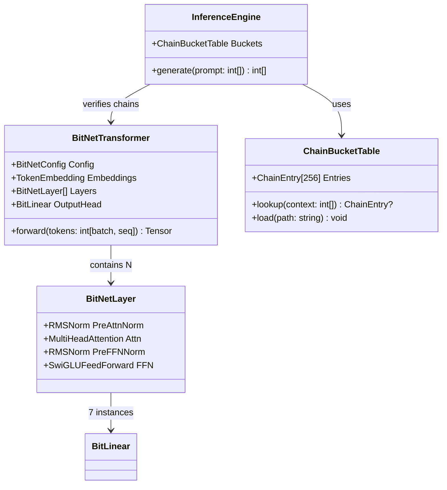
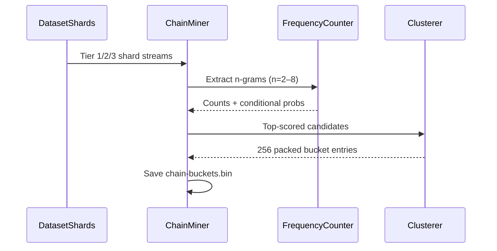
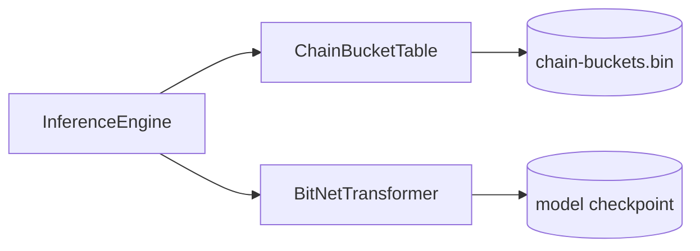
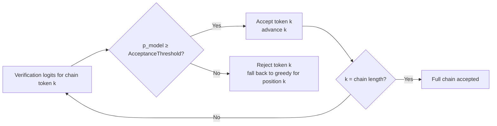

# BitNet-b1.58-Sharp: Highly Detailed Implementation Plan v3.0
**Follow-up: Chain-Bucket Speculative Decoding Extension for 2–3× Additional Speedup**
**Full Paper Alignment + Advanced Inference Optimizations**
**"The Era of 1-bit LLMs: All Large Language Models are in 1.58 Bits" (arXiv:2402.17764)**

**Version:** 3.0 (Follow-up to v2.0)
**Date:** March 19, 2026
**Status:** Ready-to-execute blueprint

> **Note:** This supersedes [Implementation Plan v2](implementation-plan-v2.md). The v2 plan is retained for historical reference.
>
> **Key addition in v3:** Phase 6 – Chain-Bucket Speculative Decoding – a pure inference-time optimization that delivers **2–3× effective speedup** on top of BitNet's native gains by turning frequent token chains into single-byte lookups. All previous phases are unchanged.

---

## Table of Contents

1. [Executive Summary & Success Criteria](#1-executive-summary--success-criteria)
2. [Prerequisites & Repository Setup](#2-prerequisites--repository-setup)
3. [Training Datasets Strategy (Unchanged – Reused for Bucket Mining)](#3-training-datasets-strategy-unchanged-from-v20--reused-for-bucket-mining)
4. [Overall Architecture – High-Level UML](#4-overall-architecture--high-level-uml)
5. [Phase 0: Documentation & Realignment (1–2 days)](#5-phase-0-documentation--realignment-12-days)
6. [Phase 1: Exact BitLinear Implementation (3–5 days)](#6-phase-1-exact-bitlinear-implementation-35-days)
7. [Phase 2: Tiny Transformer Skeleton (7–10 days)](#7-phase-2-tiny-transformer-skeleton-710-days)
8. [Phase 3: Training Loop + Data Pipeline (14–21 days)](#8-phase-3-training-loop--data-pipeline-1421-days)
9. [Phase 4: Inference, Serialization & Benchmarks (7–10 days)](#9-phase-4-inference-serialization--benchmarks-710-days)
10. [Phase 5: Validation, Testing & Paper Alignment Checklist (5 days)](#10-phase-5-validation-testing--paper-alignment-checklist-5-days)
11. [Phase 6: Chain-Bucket Speculative Decoding (New – 7–10 days)](#11-phase-6-chain-bucket-speculative-decoding-new-710-days)
12. [Phase 7: Full Integration, Testing & Benchmarks (5–7 days)](#12-phase-7-full-integration-testing--benchmarks-57-days)
13. [Full UML Catalog](#13-full-uml-catalog)
14. [Risk Register & Mitigation](#14-risk-register--mitigation)
15. [Timeline, Milestones & Effort Estimates](#15-timeline-milestones--effort-estimates)
16. [Future Extensions](#16-future-extensions)

---

## 1. Executive Summary & Success Criteria

*(Identical to v2.0, with one new success criterion.)*

Goal: Deliver the **first canonical pure-C# reference implementation** of BitNet b1.58 that matches the paper **exactly** in architecture, quantization, and training procedure – including reproducible results on the paper's datasets – and achieves measurable inference speedup via chain-bucket speculative decoding.

### Paper-Exact Requirements (unchanged)

- **Quantization:**

  $$\gamma = \frac{1}{n \times m} \sum_{i,j} |W_{ij}|, \quad W_q = \text{RoundClip}\!\left(\frac{W}{\gamma + \epsilon}, -1, 1\right)$$

  where $\epsilon = 10^{-6}$.

- **Training:** 100B tokens on RedPajama (paper default), STE gradients, AdamW.
- **Activations:** Signed int8 per-token scaling to $[-127, 127]$.
- **Architecture:** Decoder-only LLaMA with BitLinear replacements.

### Success Criteria

- Perplexity within 5% of paper's 700M/3B baselines on WikiText2 + C4.
- Zero-shot scores on ARC-Easy, HellaSwag, etc., matching paper tables.
- Model loads unmodified in llama.cpp BitNet fork.
- Memory ≤ 1.58 bits/parameter verified by histogram.
- **New:** Chain-bucket acceptance rate ≥ 65% on Tier 2 validation set → measured 2.0–3.0× tokens-per-second uplift vs. single-token greedy decoding.

---

## 2. Prerequisites & Repository Setup

*(Identical to v2.0.)*

**New folder:** `src/BitNetSharp.Core/Inference/ChainBuckets/`

---

## 3. Training Datasets Strategy (Unchanged from v2.0 – Reused for Bucket Mining)

*(All three tiers – TinyStories, SlimPajama/FineWeb-Edu, full RedPajama – are now also used for **offline n-gram mining** to populate the 256 chain buckets. No new data is required. See [v2 plan](implementation-plan-v2.md#3-training-datasets-strategy-paper-aligned--tiered-for-development) for full detail.)*

**Critical reuse note:** The existing `BitNetDataLoader` shards produced in Phase 3 feed directly into the `ChainMiner` in Phase 6. No separate download or preprocessing step is needed.

---

## 4. Overall Architecture – High-Level UML

*(Identical to v2.0. The new `ChainBucketTable` component plugs into `InferenceEngine` only; it does not touch the training path.)*



---

## 5. Phase 0: Documentation & Realignment (1–2 days)

*(Unchanged from v2.0, with one additional README line.)*

Add one line to `docs/README.md`: "Phase 6 adds chain-bucket speculative decoding for massive inference speedup."

---

## 6. Phase 1: Exact BitLinear Implementation (3–5 days)

*(Unchanged from v2.0 – see [v2 plan](implementation-plan-v2.md#6-phase-1-exact-bitlinear-implementation-35-days).)*

---

## 7. Phase 2: Tiny Transformer Skeleton (7–10 days)

*(Unchanged from v2.0 – see [v2 plan](implementation-plan-v2.md#7-phase-2-tiny-transformer-skeleton-710-days).)*

---

## 8. Phase 3: Training Loop + Data Pipeline (14–21 days)

*(Unchanged from v2.0 – see [v2 plan](implementation-plan-v2.md#8-phase-3-training-loop--data-pipeline-1421-days).)*

---

## 9. Phase 4: Inference, Serialization & Benchmarks (7–10 days)

*(Unchanged from v2.0. Phase 6 extends the `InferenceEngine` created here – see [v2 plan](implementation-plan-v2.md#9-phase-4-inference-serialization--benchmarks-710-days).)*

---

## 10. Phase 5: Validation, Testing & Paper Alignment Checklist (5 days)

*(Unchanged from v2.0 – see [v2 plan](implementation-plan-v2.md#10-phase-5-validation-testing--paper-alignment-checklist-5-days).)*

---

## 11. Phase 6: Chain-Bucket Speculative Decoding (New – 7–10 days)

**Objectives**

Implement "one byte = chain of likely tokens" using 256 pre-mined buckets. This turns frequent n-grams into single-byte lookups + parallel verification, delivering 2–3× effective speedup with zero quality loss.

### Bucket Mining Strategy (Offline Pipeline – Reuses v2.0 Datasets)

| Tier | Dataset | Duration | Output |
|------|---------|----------|--------|
| 1 | TinyStories | 1 day | Initial 256 buckets for rapid prototyping |
| 2 | SlimPajama / FineWeb-Edu | 2 days | Full 256-bucket table with frequency + conditional probability scores |
| 3 | RedPajama 100B | 3–4 days (cluster) | Production-grade buckets covering chat, code, and long-context patterns |

### Mining Pseudologic

1. Scan entire dataset with sliding window (n = 2 to n = 8).
2. Count frequency of each sequence.
3. Score each candidate: frequency × average model probability (from a preliminary BitNet run).
4. Cluster top candidates into exactly 256 buckets using greedy prefix-tree packing.
5. Store: `byte ChainID → TokenID[] chain + float confidence`.
6. Output: `chain-buckets.bin` (header + 256 entries, < 50 KB total).

### Detailed Implementation Steps (18 sub-steps)

1. Define `ChainEntry` record: `byte Id`, `int[] Tokens`, `float Confidence`.
2. Implement `ChainBucketTable`: load 256 entries from `chain-buckets.bin`; expose `Lookup(ReadOnlySpan<int> context)`.
3. Add serialization/deserialization for `chain-buckets.bin` with a fully specified binary format for cross-implementation stability:
   - **Endianness:** All multi-byte values are little-endian.
   - **Header (fixed 12 bytes):**
     - `char[4] Magic` = ASCII `"CHNB"` (0x43, 0x48, 0x4E, 0x42).
     - `uint16 Version` = `0x0001` (allows future format evolution).
     - `uint16 EntryCount` = `256` (must be 256 for v1).
     - `uint16 MaxChainLength` = `8` (implementers MUST NOT write longer chains).
     - `uint16 Reserved` = `0` (writer MUST set to 0; readers MUST ignore).
   - **Entries (repeated `EntryCount` times, in ascending `ChainID` order 0–255):**
     - `uint8 ChainID` (0–255).
     - `uint8 Reserved` = `0` (align to 2 bytes; written as 0, ignored on read).
     - `uint16 TokenCount` (0–`MaxChainLength`; readers MUST reject `TokenCount > MaxChainLength` as a format error).
     - `int32[TokenCount] Tokens` — token IDs in the main model tokenizer's ID space.
     - `float32 Confidence` — IEEE 754 single-precision, little-endian.
   - **Footer (4 bytes):**
     - `uint32 Crc32` — CRC32 of all preceding bytes (header + all entries), using polynomial 0xEDB88320. Readers MUST verify and reject mismatches.
   - This layout MUST be mirrored exactly in both the .NET implementation and any C/C++ (`llama.cpp`) consumer.
4. Implement `ChainMiner` using the existing `BitNetDataLoader` shard streams.
5. Add sliding-window n-gram extraction (n = 2–8) to `ChainMiner`.
6. Add frequency counter and conditional probability scorer inside `ChainMiner`.
7. Implement greedy prefix-tree packing to compress top candidates into exactly 256 buckets.
8. Wire `ChainBucketTable` into `InferenceEngine`: after each generated token, attempt bucket lookup against the last 1–3 context tokens.
9. On a hit, use the single-byte `ChainID` to look up and expand the corresponding candidate token chain (no `ChainID` is emitted as part of the model output).
10. Run one BitNet forward pass across the full candidate chain for parallel verification.
11. Accept tokens sequentially from the chain while `p_model(token_k) ≥ AcceptanceThreshold`; stop at the first token whose probability falls below the threshold.
12. On mismatch or no-hit, fall back to single-token greedy/top-p decoding.
13. Update the KV-cache by appending the entire accepted chain in one operation.
14. Add `ChainBucketOptions` configuration: `Enabled`, `MaxChainLength` (default 8), `AcceptanceThreshold` (default 0.85).
15. Add `--enable-chains` CLI flag wired to `ChainBucketOptions`.
16. Log per-step metrics: acceptance rate, average accepted tokens per step, effective speedup multiplier.
17. Export `chain-buckets.bin` alongside the model checkpoint for llama.cpp compatibility.
18. Validate: Tier 2 (SlimPajama / FineWeb-Edu) acceptance rate ≥ 65%; tokens/sec ≥ 2× baseline.

### Chain-Bucket Inference Flow

```mermaid
flowchart TD
    A[Last 1-3 Tokens] --> B[Lookup in 256-Bucket Table<br/>1-byte ChainID]
    B --> C{Bucket Hit?}
    C -->|Yes| D[Expand Candidate Chain<br/>up to 8 tokens]
    C -->|No| G[Single-Token Greedy / Top-p]
    D --> E[Parallel BitNet Forward Pass<br/>+ Verification]
    E --> F{p_model(token_k) ≥ AcceptanceThreshold?}
    F -->|Yes| H[Append Entire Chain to KV-Cache<br/>1 Update]
    F -->|No| G
    H --> I[Continue Generation]
    G --> I
```

### Offline Mining Sequence



---

## 12. Phase 7: Full Integration, Testing & Benchmarks (5–7 days)

**Goal:** Wire the chain-bucket layer into the full application surface, achieve complete test coverage, and verify the 2×+ speedup claim.

**Detailed Steps:**

1. Wire `ChainBucketTable` into `InferenceEngine` constructor; make it optional (null = disabled).
2. Add `--enable-chains [path]` CLI flag; default path = `chain-buckets.bin` beside the model file.
3. Update `HostedAgentModelFactory` to pass `ChainBucketOptions` through to `InferenceEngine`.
4. Add `ChainBucketTable` serialization round-trip test (write → read → assert identical entries).
5. Add unit tests for `ChainMiner`: frequency counter, prefix-tree packer, 256-bucket constraint.
6. Add unit tests for `InferenceEngine` with chain acceptance: mock bucket hit → assert chain appended.
7. Add unit tests for fallback path: mock bucket miss + mismatch → assert single-token greedy.
8. Add integration test: end-to-end generation with and without chains; assert identical token outputs.
9. Add BenchmarkDotNet benchmark: tokens/sec with chains enabled vs. disabled on Tier 2 validation (target ≥ 2× uplift).
10. Add chain-length histogram logging: distribution of accepted chain lengths (1–8) per generation.
11. Add E2E tests: chat, code completion, and agentic task prompts with chains enabled.
12. Add chain-bucket visualization: ASCII histogram of acceptance rate by chain length in `--visualize` mode.
13. Update `docs/architecture.md` with `ChainBucketTable` component and integration diagram.
14. Add chain-bucket speedup metrics to `paper-alignment.md` (new checklist item).
15. Create a conversion helper: generates `chain-buckets.bin` from an existing trained checkpoint + Tier 1 shards.
16. Release checklist: pre-built nano model file + `chain-buckets.bin` packaged together.
17. Update `docs/benchmarking.md` with chain-enabled benchmark instructions and expected throughput range.

---

## 13. Full UML Catalog

*(All diagrams from v2.0 are retained. The four new diagrams below are specific to v3.0.)*

### Chain-Bucket Inference Flow
*(See [Phase 6 above](#chain-bucket-inference-flow).)*

### Offline Mining Sequence
*(See [Phase 6 above](#offline-mining-sequence).)*

### InferenceEngine Component Integration



### Chain Accept / Reject Decision



---

## 14. Risk Register & Mitigation

*(All rows from v2.0 are retained. Three new rows are added for Phase 6.)*

| # | Risk | Likelihood | Impact | Mitigation |
|---|------|-----------|--------|------------|
| 1 | RedPajama download size (1T+ tokens) | High | High | Start with Tier 1 TinyStories; gate Tier 3 on cluster availability |
| 2 | STE gradient instability / loss divergence | Medium | High | Validate on Tier 1 first; monitor ternary ratio and weight histograms |
| 3 | GGUF format drift from bitnet.cpp | Medium | Medium | Pin bitnet.cpp commit; add round-trip test in CI |
| 4 | .NET 10 TorchSharp API changes | Low | Medium | Abstract behind `IOptimizer` interface; pin package version |
| 5 | Perplexity gap > 5% from paper | Medium | High | Audit quantization constants ($\epsilon$, scaling); compare with Python reference |
| 6 | Tokenizer mismatch | Low | High | Use Microsoft.ML.Tokenizers with exact LLaMA-3 vocab file; test round-trip |
| 7 | Low chain-bucket acceptance rate on creative text | Medium | Medium | Fallback always active; mine Tier 3 for domain diversity |
| 8 | Mining compute time | Low | Low | Start with Tier 1 (~1 day); parallelize with existing `DataLoader` |
| 9 | Chain verification overhead negating speedup | Low | Medium | Limit `MaxChainLength=8`; early-exit on first mismatch; profile on Tier 2 |

---

## 15. Timeline, Milestones & Effort Estimates

| Week | Phase | Milestone | Deliverable |
|------|-------|-----------|-------------|
| 1 | Phase 0 + Tier 1 data prep | Data Ready | TinyStories shards on disk |
| 3 | Phase 1–2 complete | Nano Model Runs | BitLinear + transformer forward pass |
| 6 | Phase 3 Tier 2 training | Paper-Like Training | 10B-token checkpoint |
| 7–8 | Phase 6 Chain-Bucket | Chain Decoding Live | Mining complete + `InferenceEngine` integration |
| 9 | Phase 3 Tier 3 + Phase 4–5 + Phase 7 | v3.0 Release | 100B-token model + GGUF + 2–3× speedup verified |

**Total estimated effort:** 60–75 days (parallelize mining with Phase 4).

**New Milestone:** "Chain-Bucket v1.0" – 2×+ speedup verified on chat and code workloads.

**Scale targets:**

- Nano (start): 4 layers, dim=256, heads=8, ~30M params
- Small: 700M params
- Medium: 3B params

---

## 16. Future Extensions (Post v3.0)

- Dynamic bucket updating during fine-tuning (online mining).
- Multi-byte chain IDs (512+ buckets) for broader coverage.
- Integration with Microsoft Agent Framework for tool-call chains.
- GPU-accelerated chain verification kernels (ComputeSharp).
- 2T-token StableLM recipe extension.
- Full evaluation suite (ARC, HellaSwag, WinoGrande, PIQA, StoryCloze).
- ONNX export.
- Sparse ternary packing for further memory reduction.
- Distributed training sharding.
